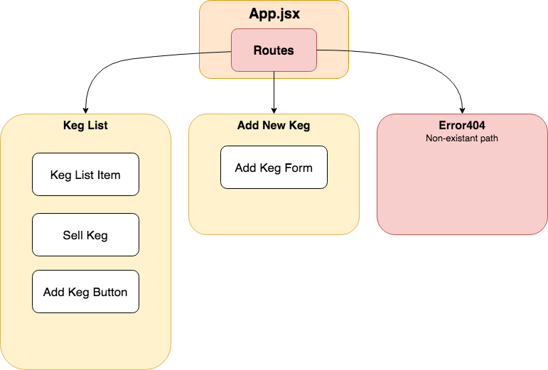

# React Angular Project Clone
**A React project for Epicodus 06.29.18**

## By Bobby Martin

## Description
This is a Friday project for Epicodus. The objective is to take an existing Angular project we've done, and turn it into a React application. I think some of the differences I'll be facing are parsing out components compared to how they are laid out in the Angular version. Also where that data lies and how I need to be passing it down to whatever corresponding children.

## Setup Requirements

* Clone this repository
* Run `npm install` to install all necessary dependencies
* Run `npm start` to start the development server

## Notes
* Component Flow  

* As I was building out the flow chart, I have been trying to figure out how I want to split up the views and not have all of them on one view.
* 
* Notes about unforeseen problems and questions during the development process go here

## Technologies
* React
* JavaScript
* CSS
* Webpack

This project uses the _MIT License_  

&copy; **Bobby Martin** 2018
